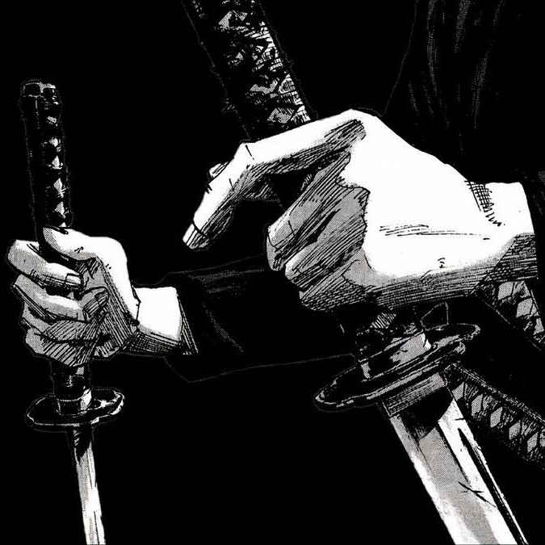
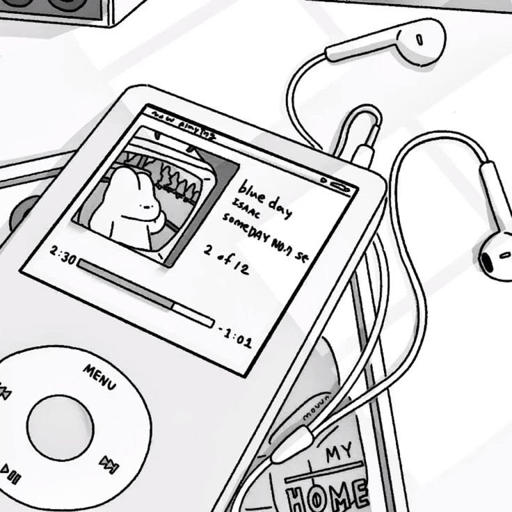
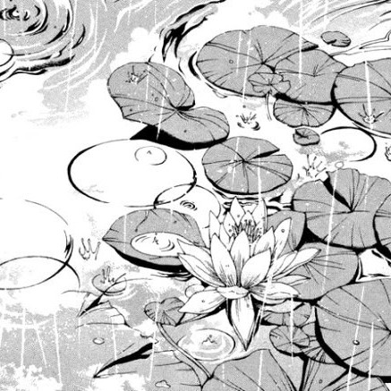

<table width="860" align="center">
<tr>
<td width="600" valign="middle">

<pre>
୨୧  bsc computing student
୨୧  interested in people + technology
୨୧  currently collecting side projects like pokémon
୨୧  looking for international grad roles!
୨୧  learning: interaction design · software project management · multi-agent systems
</pre>

</td>

<td width="260" align="center">

</td>
</tr>
</table>

`— current arc —`

<table width="860" align="center">
<tr>

<td width="286">

`[ university ]`

</td>

<td width="286">

`[ making things ]`

</td>

<td width="286">

`[ looking around ]`

</td>

</tr>
</table>

`— things i like —`

<table width="860" align="center">
<tr>
<td align="center">

<pre>
games · anime · japanese · fashion · rollerskating · writing · baking
</pre>

</td>
</tr>
</table>

`— stack —`

`thanks for stopping by ⋆｡°✩`

